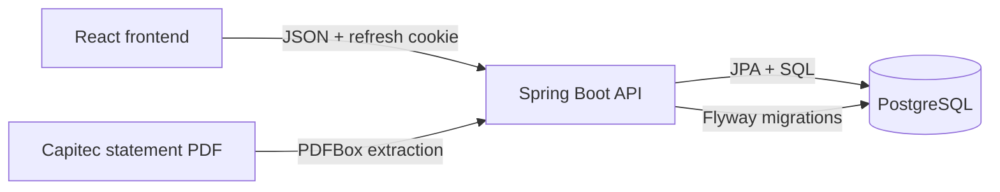

<picture>
  <source media="(prefers-color-scheme: dark)" srcset="docs/brand/dark-mode-horizontal-header.webp">
  
</picture>

# Backend

> The secure API and data layer behind the ministry's financial ledger.

[](https://openjdk.org/)
[](https://spring.io/projects/spring-boot)
[](https://www.postgresql.org/)

The Spring Boot REST API and PostgreSQL persistence layer for **Rock Ledger**. It powers authenticated ledger operations, user administration, immutable transaction history, and Capitec PDF statement imports.

| [Frontend repository](https://github.com/mr-h-digital/rock-ledger-web) | [Live frontend](https://mr-h-digital.github.io/rock-ledger-web/) |
|:---:|:---:|

## The shape of the system



## Stack

| Layer | Technology |
|---|---|
| Runtime | Java 21 · Spring Boot 3.3 |
| API security | Spring Security · signed JWT access tokens · TOTP |
| Data | PostgreSQL · Spring Data JPA · Flyway |
| Statement parsing | Apache PDFBox |
| Build | Maven |

## Get started

### You will need

- JDK 21
- Maven 3.6.3 or later
- PostgreSQL 16 (or a compatible PostgreSQL server)

### 1. Start PostgreSQL

For a local database, use Docker:

```powershell
docker run -d --name ledger-db `
  -e POSTGRES_USER=ledger `
  -e POSTGRES_PASSWORD=ledger `
  -e POSTGRES_DB=ledger `
  -p 5432:5432 postgres:16
```

The backtick is PowerShell's line-continuation character. For other shells, put the command on one line or use that shell's continuation syntax.

### 2. Configure and run the API

From this directory, set the required application secret and first-admin credentials, then launch Spring Boot:

```powershell
$env:APP_SECRET = (openssl rand -base64 48)
$env:BOOTSTRAP_ADMIN_EMAIL = "you@example.org"
$env:BOOTSTRAP_ADMIN_PASSWORD = "a-temporary-12+char-password"
$env:COOKIE_SECURE = "false"
mvn spring-boot:run
```

`APP_SECRET` must be a random string of at least 32 characters. Bootstrap credentials are used only when the database has no users. Sign in, replace the temporary password, enrol an authenticator app, and remove the bootstrap credentials from the environment.

Flyway applies the database migrations automatically. The API listens at `http://localhost:8080`; health is available at `GET /actuator/health`. Local database defaults are `ledger` / `ledger` on `localhost:5432`.

## Configuration

| Variable | Purpose | Default |
|---|---|---|
| `PORT` | HTTP server port | `8080` |
| `DATABASE_URL` | JDBC PostgreSQL URL | `jdbc:postgresql://localhost:5432/ledger` |
| `DATABASE_USER` | Database username | `ledger` |
| `DATABASE_PASSWORD` | Database password | `ledger` |
| `APP_SECRET` | Random secret (32+ characters) used to derive JWT and TOTP-encryption keys | Required |
| `ALLOWED_ORIGIN` | Exact allowed frontend origin for credentialed CORS | `http://localhost:5173` |
| `COOKIE_SECURE` | Set the refresh cookie's `Secure` flag; disable only for local HTTP | `true` |
| `BOOTSTRAP_ADMIN_EMAIL` | Initial admin email, only used if no users exist | Empty |
| `BOOTSTRAP_ADMIN_NAME` | Initial admin name | `Administrator` |
| `BOOTSTRAP_ADMIN_PASSWORD` | Initial admin temporary password | Empty |

> **Protect `APP_SECRET`.** Keep a stable, secure backup. Changing it signs users out and makes stored authenticator secrets unreadable, requiring users to enrol again. Never commit production secrets.

## API map

All routes are under `/api`. Protected routes require a bearer access token; the refresh/logout endpoints use the backend-managed refresh cookie.

| Area | Endpoints |
|---|---|
| Authentication | `POST /auth/login`, `/auth/set-password`, `/auth/enrol/start`, `/auth/enrol/confirm`, `/auth/verify`, `/auth/refresh`, `/auth/logout`, `/auth/change-password` |
| Lookups | `GET /lookups` |
| Transactions | `GET /transactions`, `POST /transactions`, `POST /transactions/{id}/reverse` |
| Bank statements | `POST /bank-statements`, `GET /bank-statements` |
| Bank lines | `GET /bank-lines?status=unposted\|posted\|all`, `POST /bank-lines/{id}/post`, `POST /bank-lines/post-fees` |
| Organisation and reports | `GET /organisation`, `GET /financial-years`, `GET /reports/year/{id}`, `GET /reports/balances`, `GET /reports/director-loans` |
| User administration | `GET /users`, `POST /users`, `POST /users/{id}/reset`, `PATCH /users/{id}/active` |

### Access roles

| Role | Permissions |
|---|---|
| `ADMIN` | Full access, including user administration |
| `TREASURER` | Capture ledger entries; import and post bank statements; read data |
| `VIEWER` | Read-only access; cannot access imported bank statements |

## Accounting safeguards

- **Append-only ledger:** Entries are never edited or deleted. A correction is another entry recorded as a reversal.
- **Loans stay distinct:** `LOAN_IN` and `LOAN_OUT` are kept separate from income and expenses.
- **Controlled bank import:** PDFs are retained as evidence; duplicate statements and lines are detected; balance-chain warnings are returned; lines wait for review before posting.
- **Auditable fees:** Bank fees can be posted as Bank charges; transaction fees are recorded separately when a line is posted.
- **Financial-year controls:** Versioned migrations establish financial years and protect closed periods.

## Database migrations

Flyway scripts are in `src/main/resources/db/migration/`. They create and seed the ledger schema, organisation, accounts, financial years, categories, and authentication tables.

> Once a migration has been applied to a deployed database, leave it unchanged. Add a new versioned migration for subsequent schema changes.

## Build and test

```bash
mvn test
mvn package
```

The executable Spring Boot JAR is generated in `target/`.

## Deploy

Deploy this repository as the backend service (for example on Railway) with a PostgreSQL database and the production environment variables above. Set `ALLOWED_ORIGIN` to the exact frontend origin and keep `COOKIE_SECURE=true` over HTTPS. Host the API on a domain that shares its registrable domain with the frontend (for example `ledger-api.rockmission.co.za` alongside `ledger.rockmission.co.za`), because the `SameSite=Strict` refresh cookie requires it.

## Source map

```text
src/main/java/za/co/rockmission/ledger/
  auth/          Password, TOTP, tokens, user administration
  config/        Spring Security, authorization, CORS
  lookup/        Capture-form reference data
  report/        Financial-year, balance, and loan reports
  statement/     PDF extraction, parsing, bank-line posting
  transaction/   Ledger API and persistence
src/main/resources/
  application.yml
  db/migration/  Versioned Flyway SQL migrations
```